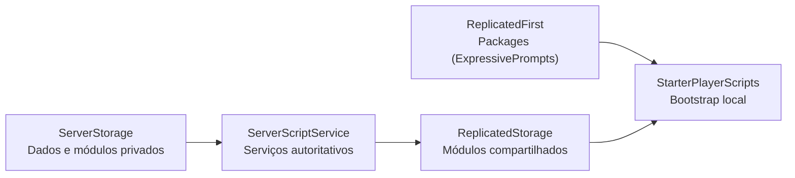

# Arquitetura

O template usa Rojo para definir a árvore do DataModel. O servidor mantém a autoridade sobre os dados persistentes e a configuração de personagens; o cliente inicializa interface, prompts e comportamentos locais.

## Mapeamento Rojo

| Diretório | Destino Roblox | Conteúdo |
| --- | --- | --- |
| `src/ReplicatedFirst/` | `ReplicatedFirst` | dependências necessárias antes do restante do cliente |
| `src/ReplicatedStorage/` | `ReplicatedStorage` | módulos compartilhados e remotes criados em execução |
| `src/StarterPlayer/StarterPlayerScripts/` | `StarterPlayer.StarterPlayerScripts` | LocalScripts globais do jogador |
| `src/StarterPlayer/StarterCharacterScripts/` | `StarterPlayer.StarterCharacterScripts` | LocalScripts para cada personagem |
| `src/ServerScriptService/` | `ServerScriptService` | serviços e regras autoritativas |
| `src/ServerStorage/` | `ServerStorage` | módulos e dependências privadas do servidor |

`default.project.json` preserva instâncias desconhecidas nos serviços principais. Isso permite usar Rojo sobre `place/GameTemplate.rbxlx` sem apagar assets que ainda existam apenas no place.

## Fluxos de execução

### Servidor

- `PlayerData.server.lua` abre e encerra sessões ProfileStore e conecta perfis ao `DataUtility`.
- `CharacterSetup.server.lua` cria `Workspace.Characters` e aplica o grupo de colisão dos jogadores.
- `RampService.server.lua` reconhece `JumpArea`, valida o mundo do jogador e controla o ciclo de carga e lançamento.
- `RampCharacterService.lua` pré-monta e replica o próximo `Character` baseado no carrinho antes da entrada, corrige as juntas do rig e mantém uma cópia privada para restauração.
- `CodeService.server.lua` valida códigos no servidor, registra resgates únicos e concede moedas usando o `DataUtility`.
- `AdminCodes.server.lua` valida comandos de chat de administradores e entrega recompensas de ferramentas no `Backpack`.
- `SettingsService.server.lua` valida e persiste as configurações de áudio, sombras e efeitos visuais recebidas do cliente.
- `WeaponService.server.lua` valida arremessos, simula projéteis em coordenadas do mundo e aplica os efeitos de granada e banana nos carrinhos.
- `QuestsService.server.lua` expõe o claim validado das missões, enquanto `QuestService.lua` mantém progresso, períodos e recompensas no perfil.
- `DailyRewardsService.server.lua` valida a coleta diária, controla o cooldown de 24 horas, concede moedas e persiste o ciclo de sete dias.

### Cliente

- `Audio/CharacterSounds.client.lua` reproduz sons locais associados ao personagem.
- `Audio/LobbyMusic.client.lua` inicia a música de lobby em loop usando `SoundData` e `SoundUtility`.
- `Interface/Bootstrap.client.lua` inicializa as animações de interface e os prompts de proximidade.
- `Interface/Hotbar.client.lua` desativa a hotbar padrão, observa as ferramentas do jogador e renderiza os slots de `StarterGui.Main.MainHUD.Hotbar`.
- `Interface/Settings.client.lua` conecta `StarterGui.Main.Frames.Settings` ao áudio, sombras e efeitos visuais locais e salva as preferências validadas pelo servidor.
- `Interface/Quests.client.lua` renderiza os cards de `StarterGui.Main.Frames.Quests`, filtra as páginas diária, semanal e mensal e solicita claims ao servidor.
- `Interface/DailyRewards.client.lua` renderiza os cards de `StarterGui.Main.Frames.DailyRewards.Content.Days`, atualiza ícone, valor e status das recompensas e solicita a coleta do dia atual.
- `Gameplay/CharacterCamera.client.lua` mantém a câmera ligada ao `Humanoid` ativo durante trocas de personagem.
- `Gameplay/RampLaunch.client.lua` oscila o medidor horizontal, o FOV de carregamento e envia a solicitação de salto quando o jogador pressiona Espaço.
- `Gameplay/WeaponController.client.lua` controla equip, animações superiores, mira e prévia balística das armas de arremesso.
- `RampSliding.client.lua` controla a física responsiva da descida durante o ciclo de vida do personagem.
- `Gameplay/SpeedFov.client.lua` aplica FOV dinâmico, inclinação suave na direção das curvas e diagnóstico dos efeitos durante a descida.
- `Effects/VisualEffectsService.client.lua` gera as faíscas locais nas rodas enquanto o carrinho está inclinado.

As preferências da interface são recebidas pelo `DataUtility` no cliente e alteradas por `SettingsService.server.lua`, que aceita somente os seis campos de configuração permitidos. `SoundUtility` controla os grupos `MusicGroup` e `SFXGroup`; `VisualEffectsService.client.lua` observa o atributo local `VFXEnabled` para criar ou remover os efeitos do carrinho.

`Modules/Gameplay/CameraEffectStack.lua` é a base compartilhada para efeitos de câmera. Cada mecânica pode obter a instância atual com `get_current()` e registrar um deslocamento nomeado de FOV com `set_effect`, removendo-o com `remove_effect` sem alterar o controlador das outras mecânicas.

`Modules/Gameplay/WeaponConfig.lua` e `ProjectileUtility.lua` são compartilhados pelo cliente e servidor para manter alcance, duração e trajetória consistentes. O cliente prevê o resultado, mas `WeaponService.server.lua` recalcula e valida o alvo antes de criar qualquer projétil. Veja [`weapons.md`](weapons.md).

## Dados e rede

`PlayerData.server.lua` é o único ponto que inicia sessões de perfil. `DataUtility` cria os remotes de dados no servidor e oferece leitura e observação no cliente. Código cliente nunca grava o perfil diretamente.

`World`, `Coins`, `EquippedCart` e `RedeemedCodes` são persistidos no perfil e `World`, `Coins` e `EquippedCart` são espelhados como atributos do `Player`. O servidor usa `World` para autorizar a entrada na `JumpArea`; o cliente recebe somente o estado de carga ou lançamento já validado.

`QuestDefinitions.lua` concentra os títulos, descrições, metas, eventos e recompensas em listas separadas para `Daily`, `Weekly` e `Monthly`. `Quests` persiste períodos, progresso e claims por categoria; `QuestService.lua` reseta os buckets quando o período diário, semanal ou mensal muda, aceita progresso somente de eventos emitidos por serviços autoritativos e concede moedas uma única vez por missão. `Quests.client.lua` reconstrói o `ScrollingFrame` de quests a partir do `Template` ao trocar o filtro.

`DailyRewardDefinitions.lua` concentra as sete recompensas de moedas e o ícone `rbxassetid://127302079179326`. `DailyRewards` persiste o dia atual, o instante da última coleta, os dias resgatados, a sequência de login e o último dia de entrada; `DailyRewardsService.server.lua` atualiza a streak uma vez por dia e libera somente o dia atual no próximo dia do calendário, impedindo coletas duplicadas ou antecipadas. A moeda só é concedida pelo `ClaimReward` acionado pelo cliente.
