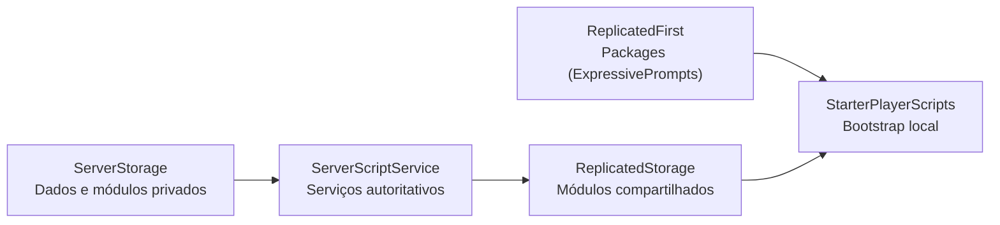

# Arquitetura

O template usa Rojo para definir a árvore do DataModel. O servidor mantém a autoridade sobre os dados persistentes e a configuração de personagens; o cliente inicializa interface, prompts e comportamentos locais.

## Mapeamento Rojo

| Diretório | Destino Roblox | Conteúdo |
| --- | --- | --- |
| `src/ReplicatedFirst/` | `ReplicatedFirst` | dependências necessárias antes do restante do cliente |
| `src/ReplicatedStorage/` | `ReplicatedStorage` | módulos compartilhados e remotes criados em execução |
| `src/StarterPlayer/StarterPlayerScripts/` | `StarterPlayer.StarterPlayerScripts` | LocalScripts globais do jogador |
| `src/StarterPlayer/StarterCharacterScripts/` | `StarterPlayer.StarterCharacterScripts` | LocalScripts para cada personagem |
| `src/ServerScriptService/` | `ServerScriptService` | serviços e regras autoritativas |
| `src/ServerStorage/` | `ServerStorage` | módulos e dependências privadas do servidor |

`default.project.json` preserva instâncias desconhecidas nos serviços principais. Isso permite usar Rojo sobre `place/GameTemplate.rbxlx` sem apagar assets que ainda existam apenas no place.

## Fluxos de execução

### Servidor

- `PlayerData.server.lua` abre e encerra sessões ProfileStore e conecta perfis ao `DataUtility`.
- `CharacterSetup.server.lua` cria `Workspace.Characters` e aplica o grupo de colisão dos jogadores.
- `RampService.server.lua` reconhece `JumpArea`, valida o mundo do jogador e controla o ciclo de carga e lançamento.
- `RampCharacterService.lua` pré-monta e replica o próximo `Character` baseado no carrinho antes da entrada, corrige as juntas do rig e mantém uma cópia privada para restauração.
- `CodeService.server.lua` valida códigos no servidor, registra resgates únicos e concede moedas usando o `DataUtility`.

### Cliente

- `Audio/CharacterSounds.client.lua` reproduz sons locais associados ao personagem.
- `Interface/Bootstrap.client.lua` inicializa as animações de interface e os prompts de proximidade.
- `Gameplay/CharacterCamera.client.lua` mantém a câmera ligada ao `Humanoid` ativo durante trocas de personagem.
- `Gameplay/RampLaunch.client.lua` oscila o medidor horizontal, o FOV de carregamento e envia a solicitação de salto quando o jogador pressiona Espaço.
- `RampSliding.client.lua` controla a física responsiva da descida durante o ciclo de vida do personagem.
- `Gameplay/SpeedFov.client.lua` aplica FOV dinâmico, inclinação suave na direção das curvas e diagnóstico dos efeitos durante a descida.
- `Effects/VisualEffectsService.client.lua` gera as faíscas locais nas rodas enquanto o carrinho está inclinado.

`Modules/Gameplay/CameraEffectStack.lua` é a base compartilhada para efeitos de câmera. Cada mecânica pode obter a instância atual com `get_current()` e registrar um deslocamento nomeado de FOV com `set_effect`, removendo-o com `remove_effect` sem alterar o controlador das outras mecânicas.

## Dados e rede

`PlayerData.server.lua` é o único ponto que inicia sessões de perfil. `DataUtility` cria os remotes de dados no servidor e oferece leitura e observação no cliente. Código cliente nunca grava o perfil diretamente.

`World`, `Coins`, `EquippedCart` e `RedeemedCodes` são persistidos no perfil e `World`, `Coins` e `EquippedCart` são espelhados como atributos do `Player`. O servidor usa `World` para autorizar a entrada na `JumpArea`; o cliente recebe somente o estado de carga ou lançamento já validado.
